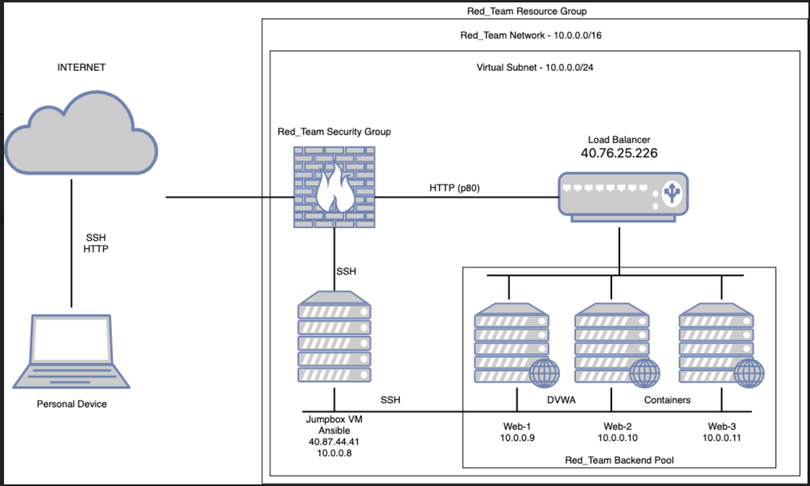
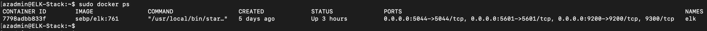

## Automated ELK Stack Deployment

The files in this repository were used to configure the network depicted below.

These files have been tested and used to generate a live ELK deployment on Azure. They can be used to either recreate the entire deployment pictured above. Alternatively, select portions of the Ansible file may be used to install only certain pieces of it, such as Filebeat.

  - [Elk Ansible Playbook](Ansible/elk-playbook.yml)
  - [Filebeat Ansible Playbook](Ansible/filebeat-playbook.yml)
  - [Metricbeat Ansible Playbook](Ansible/metricbeat-playbook.yml)
  - [Docker Ansible Playbook](Ansible/my-playbook.yml)

This document contains the following details:
- Description of the Topology
- Access Policies
- ELK Configuration
  - Beats in Use
  - Machines Being Monitored
- How to Use the Ansible Build

### Description of the Topology

The main purpose of this network is to expose a load-balanced and monitored instance of DVWA, the D*mn Vulnerable Web Application.

Load balancing ensures that the application will be highly available, in addition to restricting attacks to the network.
- _TODO: What aspect of security do load balancers protect? Availability  What is the advantage of a jump box? To make sure there is no outside access to your internal systems/web server. You secure your jumpbox and use that to connect to your internal environment.

Integrating an ELK server allows users to easily monitor the vulnerable VMs for changes to the _____ and system _____.
- _TODO: What does Filebeat watch for? Filebeat is for forwarding and centralizing log data
- _TODO: What does Metricbeat record? Metricbeat collects metrics from your systems and services.

The configuration details of each machine may be found below.
_Note: Use the [Markdown Table Generator](http://www.tablesgenerator.com/markdown_tables) to add/remove values from the table_.

| Name                 | Function              | IP Address     | Operating System |
|----------------------|-----------------------|----------------|------------------|
| ELK-Stack            | Logging Data          | 52.247.12.157  | Linux            |
| Jump-Box-Provisioner | Gateway               | 52.255.148.176 | Linux            |
| Web-1                | WebServer             | 10.0.0.9       | Linux            |
| Web-2                | WebServer             | 10.0.0.10      | Linux            |
| Web-3                | WebServer             | 10.0.0.11      | Linux            |
| LoadBalancer         | WebTrafficDistributor | 40.76.25.226   | n/a              |

### Access Policies

The machines on the internal network are not exposed to the public Internet. 

Only the JumpBox machine can accept connections from the Internet. Access to this machine is only allowed from the following IP addresses:
- _TODO: Add whitelisted IP addresses_ Public IP: 71.175.31.123

Machines within the network can only be accessed by _____.
- _TODO: Which machine did you allow to access your ELK VM? Jump-Box-Provisioner What was its IP address?_ 10.0.0.8

A summary of the access policies in place can be found in the table below.

| Name                 | Publicly Accessible   | Allowed IP Address |
|----------------------|-----------------------|--------------------|
| ELK-Stack            | Logging Data          | 10.0.0.8           |
| Jump-Box-Provisioner | Gateway               | 71.175.31.123      |
| Web-1                | WebServer             | 10.0.0.8           |
| Web-2                | WebServer             | 10.0.0.8           |
| Web-3                | WebServer             | 10.0.0.8           |
| LoadBalancer         | WebTrafficDistributor | 71.175.31.123      |

### Elk Configuration

Ansible was used to automate configuration of the ELK machine. No configuration was performed manually, which is advantageous because...
- _TODO: What is the main advantage of automating configuration with Ansible?_ We can ensure that all confiurations are identical including the version of software installed.

The playbook implements the following tasks:
- _TODO: In 3-5 bullets, explain the steps of the ELK installation play. E.g., install Docker; download image; etc._
- install docker.io
- install python3
- install docker module
- create docker container with specific image
- ensure docker is enabled on boot

The following screenshot displays the result of running `docker ps` after successfully configuring the ELK instance.

### Target Machines & Beats
This ELK server is configured to monitor the following machines:
- _TODO: List the IP addresses of the machines you are monitoring_
- Web-1 = 10.0.0.9
- Web-2 = 10.0.0.10
- Web-3 = 10.0.0.11

We have installed the following Beats on these machines:
- _TODO: Specify which Beats you successfully installed_
- Filebeat
- Metricbeat

These Beats allow us to collect the following information from each machine:
- _TODO: In 1-2 sentences, explain what kind of data each beat collects, and provide 1 example of what you expect to see. E.g., `Winlogbeat` collects Windows logs, which we use to track user logon events, etc._
- The Filebeat module can handle audit logs, deprecation logs, gc logs, server logs, and slow logs.
- Metricbeat takes the metrics and statistics that it collects (e.g. system data) and ships them to the output that you specify, such as Elasticsearch or Logstash.

### Using the Playbook
In order to use the playbook, you will need to have an Ansible control node already configured. Assuming you have such a control node provisioned: 

SSH into the control node and follow the steps below:
- Copy the ansible.cfg file to /etc/ansible
- Update the ansible.cfg file to include the remote user account that exists on all VMs
- Run the playbook, and navigate to each VM to check that the installation worked as expected.

_TODO: Answer the following questions to fill in the blanks:_
- _Which file is the playbook? Any file we created called NAME_playbook.yml Where do you copy it?_ /etc/ansible/roles
- _Which file do you update to make Ansible run the playbook on a specific machine? /etc/ansible/hosts  How do I specify which machine to install the ELK server on versus which to install Filebeat on?_ In order to specify which VM, or group of VMs, is updated, create a heading such as [webservers] and include the appropriate IP address(es). Then in the playbook itself include a line "hosts: webservers"
- _Which URL do you navigate to in order to check that the ELK server is running?  http://52.247.12.157:5601/app/kibana

_As a **Bonus**, provide the specific commands the user will need to run to download the playbook, update the files, etc._